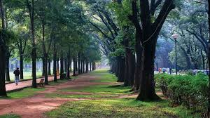
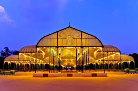
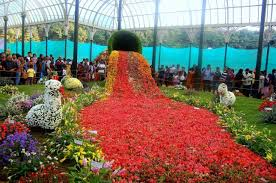
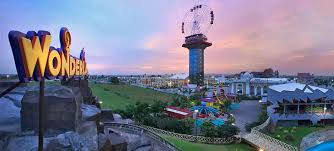
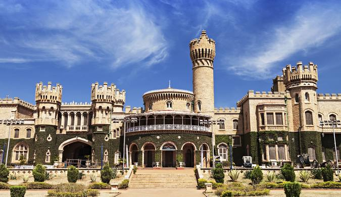

# html-city-tourism
## Ex-1
### Creating a html file to display the contents as seen in the following image.
#### Program:
##### table.html
```
<!DOCTYPE html>
<html lang="en">
<head>
    <meta charset="UTF-8">
    <meta name="viewport" content="width=device-width, initial-scale=1.0">
    <link rel="stylesheet" href="./assets'/css/style.css">
    <link rel="preconnect" href="https://fonts.googleapis.com">
    <link rel="preconnect" href="https://fonts.gstatic.com" crossorigin>
    <link href="https://fonts.googleapis.com/css2?family=Open+Sans:ital,wght@0,300..800;1,300..800&display=swap" rel="stylesheet">
    <title>Assignment-01</title>
</head>
<body>
    <main class="main">
    <table class="outer-table">
        <thead >
            <tr>
                <td colspan="2" class="outer-table-heading">My Day</td>
            </tr>
        </thead>
        <tbody>
            <tr>
                <td><ol><li>wake up early</li></ol>
                <ul>
                    <li class ="list-squared">5AM</li>
                    <br>
                    <li>walk</li>
                    <li>jog</li>
                </ul>
            </td>
            <td class="second-table" rowspan="3">
                <table class="inner-table" >
                    <thead>
                        <tr>
                            <td colspan="2">Things to watch</td>
                        </tr>
                    </thead>
                    <tbody>
                        <tr>
                            <td></td>
                            <td></td>
                        </tr>
                        <tr>
                            <td></td>
                            <td></td>
                        </tr>
                    </tbody>
                </table>
            </td>
            </tr>
            <tr>
                <td><ol start="2"><li>breakfast</li></ol>
                    <ul>
                        <li class ="list-squared">8AM</li>
                        <br>
                        <li>eggs</li>
                        <li>coffee</li>
                    </ul>
                
                </td>
                
            </tr>
            <tr>
                <td><ol start="3"><li>go to saveetha</li></ol>
                    <ul>
                        <li class ="list-squared">8AM</li>
                        <br>
                        <li>attend classes</li>
                        <li>to be continued</li>
                    </ul>
                
                </td>
            </tr>
        </tbody>
    </table>
    </main>
</body>
</html>

    
</body>
</html>
```
#### Output:


#### Result:
 Thus,Creating a html file to display the content in the above picture was executed successfully.

##### index.html
```
<!DOCTYPE html>
<html lang="en">
<head>
    <meta charset="UTF-8">
    <meta name="viewport" content="width=device-width, initial-scale=1.0">
    <title>Welcome to Tourism SpoT</title>
    <link rel="stylesheet" href="css/styles.css">
    <style>
        /* Centered Image */
        .centered-image {
          text-align: center;
          margin: 20px; /* Add some margin for better visibility */
        }
      
        /* Floated Images */
        .float-container {
          overflow: hidden; /* This is required for floated elements to work properly */
        }
        
        .float-left {
          float: left;
          margin: 10px;
          width: 45%; /* Set image width to ensure they fit side-by-side */
        }
      
        .float-right {
          float: right;
          margin: 10px;
          width: 45%;
        }
        .image-container {
            text-align: center;
          }
      </style>
</head>
<body>

<header>
    
    <h1>WELCOME TO BANGALORE CITY</h1>
</header>

<nav>
    <a href="index.html">  Home  </a>
    <a href="heritage.html"> Heritage  </a>
    <a href="hotel-booking.html"> Hotel Booking  </a>
    <a href="gallery.html"> Gallery  </a>
</nav>
<HR>
<div class="image-container">
    <h2>About Bangalore</h2>
    <p> Bengaluru is heaven for all travellers and tourists and is a famous city worldwide, not just in India. The locals are friendly and peaceful, and everyone is respected and welcomed in our beautiful city.</p>
    <HR>
        
    <p>Nandi hills, Bangalore Palace, Lal Bagh, Brigade Road, Bannerghatta National Park, Commercial Street, Wonderla, Toit, Vidhana Soudha, Innovative Film City, VV Puram Food Street, Guhantara Underground Cave Resort, Ulsoor Lake, Tipu Sultan's Summer Palace and Snow City.</p>
    <HR>
</div>

<footer>
    &copy; 2024 Bangalore City Tourism. All rights reserved.
</footer>

</body>
</html>
```
#### Output:


#### Result:
 Thus,Creating a html file to display the content in the above picture was executed successfully.

##### heritage.html
```
<!DOCTYPE html>
<html lang="en">
<head>
    <meta charset="UTF-8">
    <meta name="viewport" content="width=device-width, initial-scale=1.0">
    <title>Heritage Sites - BANGALORE City</title>
    <link rel="stylesheet" href="css/styles.css">
    <style>
        /* Centered Image */
        .centered-image {
          text-align: center;
          margin: 20px; /* Add some margin for better visibility */
        }
      
        /* Floated Images */
        .float-container {
          overflow: hidden; /* This is required for floated elements to work properly */
        }
        
        .float-left {
          float: left;
          margin: 10px;
          width: 45%; /* Set image width to ensure they fit side-by-side */
        }
      
        .float-right {
          float: right;
          margin: 10px;
          width: 45%;
        }
        .image-container {
            text-align: center;
          }
      </style>
</head>
<body>

<header>
    
    <h1>BANGALORE City</h1>
</header>

<nav>
    <a href="index.html">Home</a>
    <a href="heritage.html">Heritage</a>
    <a href="hotel-booking.html">Hotel Booking</a>
    <a href="gallery.html">Gallery</a>
</nav>

<div class="image-container">
    <h2>Heritage Sites</h2>
    <ul>
        <li><a href="site1.html"></a></li>
        <li><a href="site2.html"></a></li>
        <li><a href="site3.html"></a></li>
        <li><a href="site4.html"></a></li>
    </ul>
</div>

<footer>
    &copy; 2024 Bangalore City Tourism. All rights reserved.
</footer>

</body>
</html>
```
#### Output:


#### Result:
 Thus,Creating a html file to display the content in the above picture was executed successfully.

##### hotel-booking.html
```
<!DOCTYPE html>
<html>
<head>
<title>HOTEL BOOKINGS AND RESERVATIONS</title>
<style>
    /* Optional styling for the form */
    label {
      display: block;
      margin-bottom: 5px;
    }
    input[type="text"],
    input[type="date"],
    select {
      width: 10%;
      padding: 5px;
    }
  </style>
</head>
<body>
  <nav>
    <a href="index.html">  Home  </a>
    <a href="heritage.html"> Heritage  </a>
    <a href="hotel-booking.html"> Hotel Booking  </a>
    <a href="gallery.html"> Gallery  </a>
</nav>

<h1>BOOKINGS</h1>
<p>Bookings to be done and refund will be with terms and conditions.Please refer Hotel conditions before bookings.</p>
<h1>Hotel Room Booking</h1>
  <form action="process_booking.php" method="post">  <label for="name">Guest Name:</label>
    <input type="text" id="name" name="name" required>

    <label for="email">Email Address:</label>
    <input type="email" id="email" name="email" required>

    <label for="check_in">Check-In Date:</label>
    <input type="date" id="check_in" name="check_in" required>

    <label for="check_out">Check-Out Date:</label>
    <input type="date" id="check_out" name="check_out" required>

    <label for="guests">Number of Guests:</label>
    <select id="guests" name="guests">
      <option value="1">1</option>
      <option value="2">2</option>
      <option value="3">3</option>
      <option value="4">4</option>
    </select>

    <label for="room_type">Room Type:</label>
    <select id="room_type" name="room_type">
      <option value="standard">Standard Room</option>
      <option value="deluxe">Deluxe Room</option>
      </select>

    <br>
    <input type="submit" value="Book Now">
  </form>
</body>
</html>
```
#### Output:


#### Result:
 Thus,Creating a html file to display the content in the above picture was executed successfully.
 
##### site1.html
```
<!DOCTYPE html>
<html>
<head>
<title>Page Title</title>
<style>
    /* Centered Image */
    .centered-image {
      text-align: center;
      margin: 20px; /* Add some margin for better visibility */
    }
  
    /* Floated Images */
    .float-container {
      overflow: hidden; /* This is required for floated elements to work properly */
    }
    
    .float-left {
      float: left;
      margin: 10px;
      width: 45%; /* Set image width to ensure they fit side-by-side */
    }
  
    .float-right {
      float: right;
      margin: 10px;
      width: 45%;
    }
    .image-container {
        text-align: center;
      }
  </style>
</head>
<body>
    <nav>
        <a href="index.html">  Home  </a>
        <a href="heritage.html"> Heritage  </a>
        <a href="hotel-booking.html"> Hotel Booking  </a>
        <a href="gallery.html"> Gallery  </a>
    </nav>
<h1>Lalbagh</h1>

<p>Lalbagh is one of Bengaluru’s major attractions. A sprawling garden situated in a 240 acres piece of land in the heart of the city, Lalbagh houses India’s largest collection of tropical plants and sub-tropical plants, including trees that are several centuries old. Exhibits like the Snow White and the seven dwarfs, and a topiary park, an expansive lake, a beautiful glasshouse modelled around the Crystal Palace in London adorn the park giving it a surrealistic atmosphere. A watchtower perched on top of a 3000 million years old rocky outcrop (which is a National Geological Monument), built by Kempegowda, the founder of Bengaluru also adorns the picturesque garden.</p>
<h2>Why visit Lalbagh:</h2>
<p><h1>Lalbagh Glass House: </h1>Lalbagh Glass House is a giant palace like glass and iron structure, inspired by Crystal Palace in London’s Hyde Park. Lalbagh glass house was built in 1989 and renovated in 2004 and remains the primary attraction for visitors of Lalbagh.

    <h1>Lalbagh Lake:</h1> Lalbagh has a large lake in its southern part, complete with walking trails, a bridge and a mini waterfall.
    
    <h1>Seasonal attractions at Lalbagh:</h1> Lalbagh hosts several events throughout the year- Lalbagh flower show during Republic Day (26 January) and Independence Day (15 August), Mango/Jackfruit festivals during summer, cultural shows at Band stand are some of the popular events held in Lalbagh.</p>
</body>
</html>
```
#### Output:


#### Result:
 Thus,Creating a html file to display the content in the above picture was executed successfully.
##### site2.html
```
<!DOCTYPE html>
<html>
<head>
<title>Page Title</title>
<style>
    /* Centered Image */
    .centered-image {
      text-align: center;
      margin: 20px; /* Add some margin for better visibility */
    }
  
    /* Floated Images */
    .float-container {
      overflow: hidden; /* This is required for floated elements to work properly */
    }
    
    .float-left {
      float: left;
      margin: 10px;
      width: 45%; /* Set image width to ensure they fit side-by-side */
    }
  
    .float-right {
      float: right;
      margin: 10px;
      width: 45%;
    }
    .image-container {
        text-align: center;
      }
  </style>
</head>
<body>
    <nav>
        <a href="index.html">  Home  </a>
        <a href="heritage.html"> Heritage  </a>
        <a href="hotel-booking.html"> Hotel Booking  </a>
        <a href="gallery.html"> Gallery  </a>
    </nav>
<h1>Bangalore Palace</h1>

<p>The area where the palace now stands originally belonged to a school principal of the cantonment town, Reverend J Garrett. The British Guardians of the minor Maharaja purchased the area with Chamarajendra Wadiyar X's accumulated funds so that his education and administrative training could take place easily.

    April 1874 marked the beginning of the construction of the palace. John Cameron, the artistic mind behind Lalbagh took the responsibility of landscaping. During 1878 AD the initial construction got completed. Following the initial completion, subsequent years called for many additions and improvements. Maharaja Jayachamaraja during his reign added portions outside the Darbar Hall. Renovations took place so that the Palace could have an essence of Windsor Castle of London that had bestowed the king.
    
    The ownership of the Bangalore Palace has gone through many legal activities. Presently, it is under the ownership of the descendant of the Mysore Royal Family, Srikanta Datta Narasimharaja Wadiyar. The palace opened its doors to the public in 2005.</p>

</body>
</html>
```
#### Output:


#### Result:
 Thus,Creating a html file to display the content in the above picture was executed successfully.
##### site3.html
```
<!DOCTYPE html>
<html>
<head>
<title>Page Title</title>
<style>
    /* Centered Image */
    .centered-image {
      text-align: center;
      margin: 20px; /* Add some margin for better visibility */
    }
  
    /* Floated Images */
    .float-container {
      overflow: hidden; /* This is required for floated elements to work properly */
    }
    
    .float-left {
      float: left;
      margin: 10px;
      width: 45%; /* Set image width to ensure they fit side-by-side */
    }
  
    .float-right {
      float: right;
      margin: 10px;
      width: 45%;
    }
    .image-container {
        text-align: center;
      }
  </style>
</head>
<body>
    <nav>
        <a href="index.html">  Home  </a>
        <a href="heritage.html"> Heritage  </a>
        <a href="hotel-booking.html"> Hotel Booking  </a>
        <a href="gallery.html"> Gallery  </a>
    </nav>
<h1>Cubbon Park</h1>

<p>Spread over an area of 300 acres, Cubbon Park in the city of Bangalore is a major sightseeing attraction rich in green foliage. It is a green belt region of the city and is an ideal place for nature lovers and those seeking a calm atmosphere. Having been laid down by Lord Cubbon, the park is named so in his honour. It is home to more than 6,000 trees that support a vibrant ecosystem. In addition to being a natural sightseeing destination, some of the major structures of the city such as the Attara Kacheri, Cubbon Park Museum and Sheshadri Iyer Memorial Park are also situated here. Another famous attraction in the Cubbon Park is The Bangalore Aquarium, which is the second largest aquarium in India.

    Cubbon Park was originally spread over 100 acres, which was later extended to 300 acres. First established in the year 1870 by Sri John Meade (acting Commissioner of Mysore), Cubbon Park has a long history. Major General Richard Sankey (Chief Engineer of the State) conceived this park in honour of Sri John Meade. Initially, the park was called "Meade's Park" and later came to be known as the Cubbon Park. Since the introduction of the park, it was made and improved in many ways.
    
    In the year 1927, the park was officially renamed as "Sri. Chamarajendra Park" to mark the Silver Jubilee of Sri. Krishnaraja Wodeyar's rule in Mysore State. At present, the Cubbon Park is under the control of the Department of Horticulture. The Deputy Director of Horticulture (Cubbon Park) is responsible for the administration and maintenance of the park.</p>

</body>
</html>
```
#### Output:


#### Result:
 Thus,Creating a html file to display the content in the above picture was executed successfully.
#### site4.html
```
<!DOCTYPE html>
<html>
<head>
<title>Page Title</title>
<style>
    /* Centered Image */
    .centered-image {
      text-align: center;
      margin: 20px; /* Add some margin for better visibility */
    }
  
    /* Floated Images */
    .float-container {
      overflow: hidden; /* This is required for floated elements to work properly */
    }
    
    .float-left {
      float: left;
      margin: 10px;
      width: 45%; /* Set image width to ensure they fit side-by-side */
    }
  
    .float-right {
      float: right;
      margin: 10px;
      width: 45%;
    }
    .image-container {
        text-align: center;
      }
  </style>
</head>
<body>
    <nav>
        <a href="index.html">  Home  </a>
        <a href="heritage.html"> Heritage  </a>
        <a href="hotel-booking.html"> Hotel Booking  </a>
        <a href="gallery.html"> Gallery  </a>
    </nav>
<h1>WONDERLA</h1>

<p>Great experience. went for the second time in the previous four years. Over the weekend, the crowd was mild. Would advise guests to only bring nylon or synthetic clothing for the rides and swimming pools. Shopping outside is preferable because it is less expensive. Additionally, clients can pay for food outlets throughout the park using the RFID-integrated EZ band they receive to wear around their wrist when using the locker facility.</p>

</body>
</html>
```
#### Output:


#### Result:
 Thus,Creating a html file to display the content in the above picture was executed successfully.
